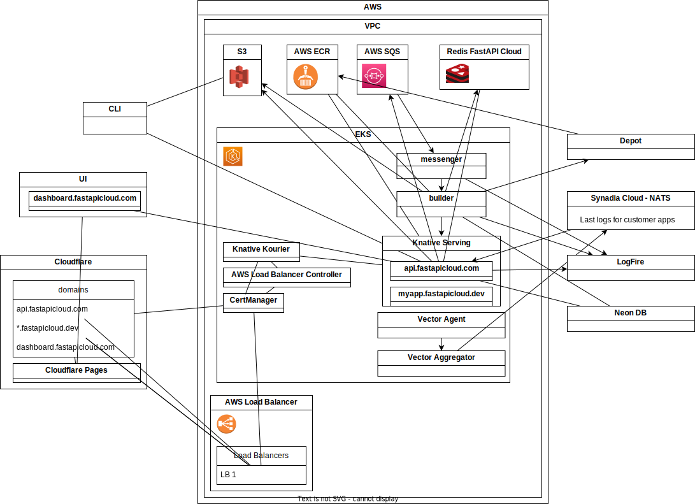

# FastAPI Cloud Infra

This is the infra for FastAPI Cloud. This document contains a short tour.

It will evolve over time. There's a chance that when you read this some things have changed and we forgot to update the README. Sorry. 🙈



**Note**: you can edit this diagram file with draw.io, directly in VS Code.

## AWS Environments

There are **3 AWS accounts**, **development**, **staging**, and **production**.

Pulumi with all the AWS stuff will run on **staging** when merging to `master` and on **production** when making a release. It doesn't run automatically on **development**, we run things there by hand, to test things out.

## AWS CLI

Install the AWS CLI: https://docs.aws.amazon.com/cli/latest/userguide/getting-started-install.html

Configure the AWS CLI with SSO (single sign-on). Use the tutorial tabs for for "IAM Identity Center": https://docs.aws.amazon.com/cli/latest/userguide/cli-configure-sso.html#cli-configure-sso-configure

It will guide you to run:

```bash
aws configure sso
```

It could ask you for the SSO URL, the region, and the account ID. You can get those from the AWS login for the company: https://fastapilabs.awsapps.com/start/

Then it will ask you for the role name.

Use the role `FastAPILabsPowerUserK8s`.

Use a short profile name instead of the default one so that you can use it later. For example:

* `development`
* `staging`
* `production`

Later, you can configure it again and set the profile name to `default` to use it by default.

**Note**: you only need to do this once per environment.

### AWS SSO Login

Every few hours, you will need to login again to AWS, use the command:

```bash
aws sso login --profile profile_name
```

### Configure `kubectl` with AWS

Follow: https://docs.aws.amazon.com/eks/latest/userguide/create-kubeconfig.html

You will need the name of the cluster, you can get it from the Pulumi output, by going to the AWS web console, going to Elastic Kubernetes Service, and copying the name of the cluster, or by running this:

Create an `ENVIRONMENT` env var (`development`, `staging`, `production`):

```bash
export ENVIRONMENT=development
```

Set up `kubectl`:

```bash
# Get the cluster name
export CLUSTER_NAME=$(aws eks --region us-east-1 list-clusters --profile $ENVIRONMENT --query 'clusters[0]' --output text)
# Configure kubectl with that cluster
aws eks --region us-east-1 update-kubeconfig --name $CLUSTER_NAME --profile development
```

### Configure the kubectl context/environment

After running the steps above for each AWS environment, each with have a `kubectl` "context".

You can to list all the contexts with:

```bash
kubectl config get-contexts
```

Then, to use one context, you can:

```bash
kubectl config use-context context_name
```

By default the context will have the long name of the cluster, you can rename it to something shorter, for example to `development`, `staging`, `production`:

```bash
kubectl config rename-context long_name development
```

After that, you can use that `development` context with:

```bash
kubectl config use-context development
```

## Pulumi

`infra/__main__.py` and other files have the main Pulumi code.

### AWS Resources

Pulumi will create a VPC with the network tags needed by the load balancers used with Kubernetes.

Then it creates an EKS cluster with that VPC.

The infra will need one or more AWS Load Balancers later. Those will be created by another component **from inside of Kubernetes** called "AWS Load Balancer Controller" that we'll install later. That component lives in the Kubernetes side, not the AWS side, but controls things from the AWS side (load balancers). That AWS Load Balancer Controller needs a Kubernetes "Service Account" that is connected to an AWS IAM Role with an AWS IAM Policy that allows it to manage the Load Balancers.

The Pulumi code creates that IAM Policy, the IAM Role, connects them, and makes them accessible via a Kubernetes Service Account name (that we haven't created yet, but we will, using that same name).

Up to this point, Pulumi has been creating and managing AWS resources only.

### Kubernetes Resources

Then, Pulumi uses the EKS Kubernetes created as a Pulumi "provider" that is used for the next parts involving Kubernetes.

It creates a Kubernetes Service Account with the same name we defined above, and it attaches the AWS IAM Role we created above.

This part of the Kubernetes setup is done in Pulumi because it's strongly connected to the AWS resources just created, so it's easier to do that in the Pulumi side.

Next we will install some Helm Charts. And although Pulumi has (in theory) some support for Helm Charts with two different resources, I couldn't make it work yet. So, for now, we won't use Pulumi for the rest of the Kubernetes setup.

### Pulumi Export

At the end, Pulumi exports several values from the outcome. Some can be useful during debugging, one in particular is needed for the rest of the setup, the Kubernetes "Kubeconfig".

### Pulumi Deploy GitHub Action

`.github/workflows/pulumi-deploy.yml` is the GitHub Action that starts the deployment automatically.

It uses GitHub Action Secrets and environment variables in a GitHub Environment to configure credentials for Pulumi and AWS (staging or production).

Then it runs the Pulumi deployment.

It will also run on "workflow dispatch", which means, run manually from the GitHub Actions UI. When it's run that way, there's an option to run it with debug enabled. When that is done, at the end, it starts a Tmate session that can be used to manually deploy the rest of the Kubernetes components.

### Pulumi Manually

If you are deploying a cluster manually, for example the `development` cluster, you can do the following.

Export the AWS environment variables for Pulumi for that AWS account (e.g. `development`):

```bash
export AWS_ACCESS_KEY_ID=...
export AWS_SECRET_ACCESS_KEY=...
```

Then run Pulumi:

```bash
pulumi up
```

After it, create a new terminal so that any commands you run don't use the same environment variables, for example, communicating with Kubernetes using `kubectl`.

### Pulumi Outputs

After Pulumi finishes, take note of the Pulumi outputs.

Update the environment variables in the GitHub Action Secrets and environment variables for the GitHub environment:

* `s3_deployment_customer_apps`: `AWS_DEPLOYMENT_BUCKET` environment variable
* `ecr_registry_url`: `ECR_REGISTRY_URL` environment variable
* `redis_backend`: `REDIS_SERVER` environment variable
* `kubeconfig`: `KUBECONFIG_DATA` environment variable

To get the `kubeconfig` value, you can run:

```bash
pulumi stack output kubeconfig
```

## Kubernetes Deployment

Once you have access to the Kubernetes cluster from `kubectl` you can deploy the rest of the Kubernetes components.

If you just deployed the cluster, you need to go read above and [Configure `kubectl` with AWS](#configure-kubectl-with-aws), and [Change the `kubectl` context/environment](#configure-the-kubectl-contextenvironment).

Create an `ENVIRONMENT` env var:

```bash
export ENVIRONMENT=development
```

Set up the cluster:

```bash
# Get the cluster name
export CLUSTER_NAME=$(aws eks --region us-east-1 list-clusters --profile $ENVIRONMENT --query 'clusters[0]' --output text)
# Configure kubectl with that cluster
aws eks --region us-east-1 update-kubeconfig --name $CLUSTER_NAME --profile $ENVIRONMENT
```

Then rename the context:

```bash
kubectl config rename-context ...
```

### Helm Charts

Start with `infra/deploy-helm.sh`.

Create an `ENVIRONMENT` env var:

```bash
export ENVIRONMENT=development
```

Create an environment variable `CLUSTER_NAME`:

```bash
# Get the cluster name
export CLUSTER_NAME=$(aws eks --region us-east-1 list-clusters --profile $ENVIRONMENT --query 'clusters[0]' --output text)
```

Then run:

```bash
cd infra
bash deploy-helm.sh
```

This script will:

* Expects `kubectl` to be already configured.
* Use Helm to install the following Helm Charts:
    * AWS Load Balancer Controller: this creates the AWS Load Balancers allow the external world to communicate with our Kubernetes cluster. This uses the Kubernetes Service Account we created with Pulumi.
    * Cert Manager: this will manage the TLS (HTTPS) certificates obtained from Let's Encrypt. We'll configure more things later for it.
        * It seems this needs to call the AWS Load Balancer Controller, and it might not be ready yet, so this might **take a second run** to install successfully.

**Note**: interactions with the AWS Load Balancer Controller might need a **second run to install** successfully.

### Kubernetes Manifests

After having the Helm Charts installed, install other non-Helm Kubernetes resources.

Continue with: `infra/deploy-kubectl.sh`.

This script expects some environment variables to be set. If running on the GitHub Action, they are set automatically. If running locally, set them manually.

* `CLOUDFLARE_API_TOKEN_SSL` with the Cloudflare SSL user API token for Knative serving:

```bash
export CLOUDFLARE_API_TOKEN_SSL=...
```

**Note**: this is not an account token (beta), it's a profile user token.

* `REGISTRY_ID` with the AWS ECR registry ID, you can get it from [Login to AWS ECR](#login-to-aws-ecr):

```bash
export REGISTRY_ID=$(aws ecr describe-registry --profile $ENVIRONMENT --query "registryId" --output text)
```

It also expects an `ENVIRONMENT` with the name of the environment, from `development`, `staging`, or `production`. By default it is set to `development`, which is what you would use when deploying locally.

Then run:

```bash
cd infra
bash deploy-kubectl.sh
```

This script will:

* Expect `kubectl` to be already configured.
* Add the Cert Manager resources: the staging and production issuers.
* Install Cloudflare's Origin Server CA to obtain certificates for Cloudflare to communicate with the cluster (final users will communicate through Cloudflare).
* Install the Knative CRDs (Custom Resource Definitions for Kubernetes).
* Install Knative Serving and Kourier as the Knative network layer. This uses Kustomize with the files and directories in `infra/k8s/knative` (described below).
* Install the role to allow FastAPI Cloud to create Knative services.

### Cloudflare DNS

* Get the AWS Load Balancer DNS name, copy it from the command above or get it with the AWS CLI:

```bash
aws elbv2 describe-load-balancers --profile $ENVIRONMENT --query 'LoadBalancers[*].DNSName' --output text
```

We need to update the DNS records in Cloudflare manually with this AWS Load Balancer DNS name.

**Note**: for this step to work, the load balancer and cluster must be working, or must be off completely. If there's a response from the cluster but it doesn't validate the certificate (e.g. Cloudflare Origin CA certificate), configuring the Custom Hostnames might not work.

#### Development

In `fastapicloud.space`:

* Configure SSL/TLS encryption encryption mode: Full (strict): SSL/TLS -> Overview -> Configure.
* Enable redirect HTTPS, SSL/TLS -> Edge Certificates -> Always Use HTTPS.
* Add a `CNAME` record pointing `cluster-fastapicloud.fastapicloud.space` to the **AWS Load Balancer DNS**.
* Add a `CNAME` record pointing `*.fastapicloud.space` to the **AWS Load Balancer DNS**.
* Add a `CNAME` record pointing `customdomain-fastapicloud.fastapicloud.space` to `cluster-fastapicloud.fastapicloud.space`.
* Enable SaaS, SSL/TLS -> Custom Hostnames -> Fallback Origin: `cluster-fastapicloud.fastapicloud.space`.
* SSL/TLS -> Custom Hostnames -> Add Custom Hostname with `TXT` validation: `api.fastapicloud.site`.
* Copy the `TXT` certificate validation record.

In `fastapicloud.site`:

* Configure SSL/TLS encryption encryption mode: Full (strict): SSL/TLS -> Overview -> Configure.
* Enable redirect HTTPS, SSL/TLS -> Edge Certificates -> Always Use HTTPS.
* Add the `TXT` record for validating `api.fastapicloud.site`.
* Add a `CNAME` record pointing `customdomain.fastapicloud.site` to `customdomain-fastapicloud.fastapicloud.space`.
* Add a `CNAME` record pointing `api.fastapicloud.site` to `customdomain.fastapicloud.site`.

#### Staging

In `fastapicloud.club`:

* Configure SSL/TLS encryption encryption mode: Full (strict): SSL/TLS -> Overview -> Configure.
* Enable redirect HTTPS, SSL/TLS -> Edge Certificates -> Always Use HTTPS.
* Add a `CNAME` record pointing `cluster-fastapicloud.fastapicloud.club` to the **AWS Load Balancer DNS**.
* Add a `CNAME` record pointing `*.fastapicloud.club` to the **AWS Load Balancer DNS**.
* Add a `CNAME` record pointing `customdomain-fastapicloud.fastapicloud.club` to `cluster-fastapicloud.fastapicloud.club`.
* Enable SaaS, SSL/TLS -> Custom Hostnames -> Fallback Origin: `cluster-fastapicloud.fastapicloud.club`.
* SSL/TLS -> Custom Hostnames -> Add Custom Hostname with `TXT` validation: `api.fastapicloud.work`.
* Copy the `TXT` certificate validation record.

In `fastapicloud.work`:

* Configure SSL/TLS encryption encryption mode: Full (strict): SSL/TLS -> Overview -> Configure.
* Enable redirect HTTPS, SSL/TLS -> Edge Certificates -> Always Use HTTPS.
* Add the `TXT` record for validating `api.fastapicloud.work`.
* Add a `CNAME` record pointing `customdomain.fastapicloud.work` to `customdomain-fastapicloud.fastapicloud.club`.
* Add a `CNAME` record pointing `api.fastapicloud.work` to `customdomain.fastapicloud.work`.

### Production

In `fastapicloud.dev`:

* Configure SSL/TLS encryption encryption mode: Full (strict): SSL/TLS -> Overview -> Configure.
* Enable redirect HTTPS, SSL/TLS -> Edge Certificates -> Always Use HTTPS.
* Add a `CNAME` record pointing `cluster-fastapicloud.fastapicloud.dev` to the **AWS Load Balancer DNS**.
* Add a `CNAME` record pointing `*.fastapicloud.dev` to the **AWS Load Balancer DNS**.
* Add a `CNAME` record pointing `customdomain-fastapicloud.fastapicloud.dev` to `cluster-fastapicloud.fastapicloud.dev`.
* Enable SaaS, SSL/TLS -> Custom Hostnames -> Fallback Origin: `cluster-fastapicloud.fastapicloud.dev`.
* SSL/TLS -> Custom Hostnames -> Add Custom Hostname with `TXT` validation: `api.fastapicloud.com`.
* Copy the `TXT` certificate validation record.

In `fastapicloud.com`:

* Configure SSL/TLS encryption encryption mode: Full (strict): SSL/TLS -> Overview -> Configure.
* Enable redirect HTTPS, SSL/TLS -> Edge Certificates -> Always Use HTTPS.
* Add the `TXT` record for validating `api.fastapicloud.com`.
* Add a `CNAME` record pointing `customdomain.fastapicloud.com` to `customdomain-fastapicloud.fastapicloud.dev`.
* Add a `CNAME` record pointing `api.fastapicloud.com` to `customdomain.fastapicloud.com`.

### How Knative Kustomize Works

Knative uses Kourier for the network. Kourier is in charge of handling the network traffic from the outside world into Knative, through Kubernetes.

Kourier uses the AWS Load Balancer Controller to create an AWS Load Balancer.

To explore the Knative Kustomize installation start with `infra/k8s/knative/base/kustomization.yaml`.

It uses the Knative and Kourier releases from GitHub (as described in the Knative and Kourier installation instructions).

Then it uses Kustomize to patch (update) several configs.

* It patches Knative to make it use Kourier.
* It patches Knative to update the default domain name for apps, to make them top-level sub-domains (e.g. of `fastapicloud.dev` or `fastapicloud.club`).
  * That way the final customer app is something like `my-awesome-app-12acs.fastapicloud.dev`, otherwise, it would include the Kubernetes namespace by default, like `my-awesome-app-12acs.team-avengers.fastapicloud.dev`.
  * But second level sub-domains are not allowed by Let's Encrypt for wildcard certificates, only one level of wildcard certs. Having a single wildcard certificate allows us to start serving an app right after it's deployed, without waiting for the potentially slow dance to acquire certs from Let's Encrypt.
* It patches Kourier to make it use the AWS Load Balancer Controller so that it creates an AWS Load Balancer to communicate with the external world.
* It patches Kourier to use the custom certificate for the Knative domain created before.

#### About the Knative Kustomize Overlay

The previous file is not really used directly.

Instead, one of two Kustomize "overlays" is used, one for production, one for staging, and one for development.

These overlays extend the `base` Kustomize configuration and add the Knative domain used for production (`fastapicloud.dev`), staging (`fastapicloud.club`), or development (`fastapicloud.site`).

## Deploy Backend and Builder

Go to GitHub Actions and "dispatch" a workflow run for the "Deploy Backend" and "Deploy Builder" workflows, select the environment to use.

## Create a new Environment from Scratch

You would normally follow the steps above, this is only if there's a new environment needed (apart from the existing ones, `development`, `staging`, `production`).

### Create a new AWS Account

* Open the `fastapilabs` account with an admin account (Sebastián).
* Go to AWS Organizations -> Accounts -> Create Account.
* Set the account email to `sebastian+aws-{environment name}@fastapilabs.com` e.g.: `sebastian+aws-development@fastapilabs.com`.

### Confirm Permission sets are available

There should be some Multi-account "permission sets" already configured, this step is just to confirm they are there.

* While still in the `fastapilabs` account, go to IAM Identity Center -> Multi-account permissions -> Permissions sets.
* There should be 3 permission sets: `AdministratorAccess`, `PowerUserAccess`, `FastAPILabsPowerUserK8s`.
* `AdministratorAccess`, `PowerUserAccess` are managed by AWS, there's a custom role `FastAPILabsPowerUserK8s` that gives access to the Kubernetes cluster.
* `FastAPILabsPowerUserK8s` should include `PowerUserAccess` and the inline policy:

```json
{
    "Version": "2012-10-17",
    "Statement": [
        {
            "Sid": "Statement1",
            "Effect": "Allow",
            "Action": [
                "eks:ListFargateProfiles",
                "eks:DescribeNodegroup",
                "eks:ListNodegroups",
                "eks:ListUpdates",
                "eks:AccessKubernetesApi",
                "eks:ListAddons",
                "eks:DescribeCluster",
                "eks:DescribeAddonVersions",
                "eks:ListClusters",
                "eks:ListIdentityProviderConfigs",
                "iam:ListRoles"
            ],
            "Resource": [
                "*"
            ]
        },
        {
            "Effect": "Allow",
            "Action": "ssm:GetParameter",
            "Resource": [
                "arn:aws:ssm:*:730335251839:parameter/*",
                "arn:aws:ssm:*:471112862740:parameter/*"
            ]
        }
    ]
}
```

### Add Users to new Account

* While still in the `fastapilabs` account, go to IAM Identity Center -> Multi-account permissions -> AWS accounts. Click the new account.
* The list of "Assigned users and groups" would be empty. Click on "Assign users and groups". Click the tab Users (not Groups).
* Select all the users that should have some permissions. Probably all should have at least `FastAPILabsPowerUserK8s`. Then click on Next.
* Select the roles that should be added to these selected users (probably `FastAPILabsPowerUserK8s`). Then click on Next.
* Review and click on Submit.
* Repeat for any extra roles needed. For example, anyone that needs to create AWS resources by hand while testing them could have `AdministratorAccess`.

### Create Pulumi IAM User

* Go to the main AWS access portal, open the new account with the `AdministratorAccess` role.
* Go to IAM -> Users -> Create user.
* Create a user `pulumi` with `AdministratorAccess` permissions.
* Attach the `AdministratorAccess` policy. There's no need to create a group as this will be only used by Pulumi.
* Click on the user, then click the link to "Create access key".
* Select "Third-party service".
* There's no need for a description, create the access key.
* Copy the Access key ID and the Secret access key. Save them in a secure location (Sebastián would be the one doing this).

### Add Kustomize files

A new environment would need its own versions of some files.

#### CertManager

A new environment would need:

* Its own Cloudflare Origin CA config `k8s/cloudflare/origin-ca-cert-${ENVIRONMENT}.yaml`

#### Knative Serving

* Kustomize files in `infra/k8s/knative/overlays/` to configure the domains for Knative.

### Add Pulumi stack files

A new environment would need its own versions of `infra/Pulumi.{environment}.yaml`.

### Mailgun

Set up Mailgun domain, update DNS in Cloudflare.

Store credentials on GitHub Environment secrets and vars.

### DB

Create DB on Neon, store credentials on GitHub Environment secrets and vars.

Configure it not to suspend.

Configure it to use connection pool.

### GitHub Environment

Add GitHub Environment secrets and variables copying from another environment and updating.

### Cloudflare Pages

Create a new Cloudflare Pages project and deploy once by hand so that the project exists.

Update the GitHub Environment variable `CLOUDFLARE_PAGES_PROJECT_NAME` with the new project name.

### Cloudflare for SaaS

Go to the zone for the new environment domain, go to SSL/TLS -> Custom Hostnames -> Enable Cloudflare for SaaS.

## Destroy an AWS Environment

To destroy an environment in AWS do the following.

* Set up the env vars for Pulumi as described in deploying with [Pulumi Manually](#pulumi-manually):

```bash
export AWS_ACCESS_KEY_ID=...
export AWS_SECRET_ACCESS_KEY=...
```

* Destroy the Pulumi stack:

```bash
pulumi destroy
```

While Pulumi is destroying the cluster, some additional steps need to be done manually for it to be able to finish.

* Delete the `default` service account:

```bash
kubectl delete serviceaccounts default
```

**Note**: the service account is created automatically again, you might need to delete it again if Pulumi is not yet at that point.

* Delete the ECR repositories from the AWS Console, those were created by our code. The ones created by Pulumi also need to be deleted by hand because they contain images that Pulumi doesn't delete.

* Delete the S3 bucket's contents and the bucket.

* Delete the AWS Load Balancers from the AWS Console, those were created by the AWS Load Balancer Controller.

* Delete the VPC manually from the AWS Console.
    * There are security groups created by the AWS Load Balancer Controller that depend on the VPC and block the VPC for deletion.
    * If Pulumi hasn't destroyed the other resources, the VPC will be blocked for deletion, wait for Pulumi to destroy them to be able to destroy the VPC.

After that, the `pulumi destroy` command should be able to finish.
